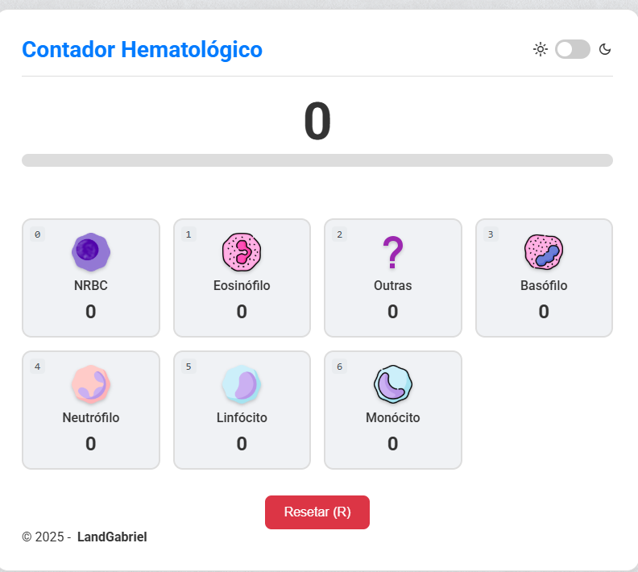
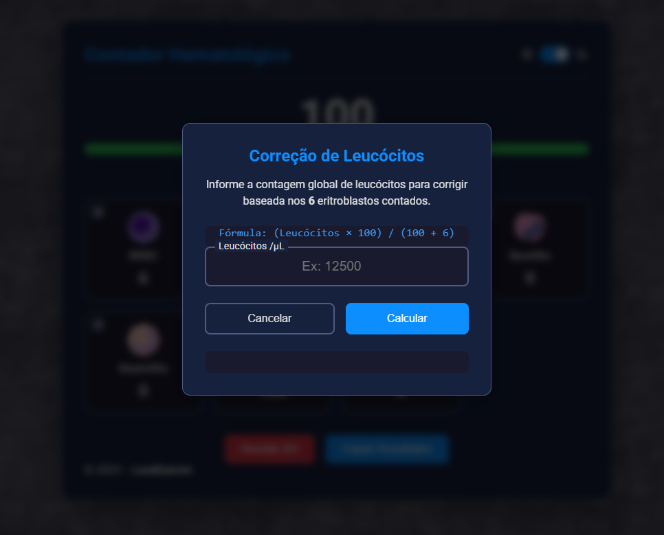

# 🔬 Contador Hematológico Pro

<p align="center">
  Um contador de células digital, moderno e interativo, projetado para auxiliar estudantes e profissionais de laboratório na contagem diferencial de leucócitos e na correção automática de eritroblastos.
</p>

<p align="center">
  
</p>
<p align="center">
  
</p>

---

## ✨ Funcionalidades Principais

Este projeto foi desenvolvido com foco na usabilidade e eficiência para o dia a dia de análises clínicas.

* **✔️ Contagem Diferencial de 100 Células:** O contador para automaticamente ao atingir 100 leucócitos, garantindo a padronização da contagem.
* **✔️ Correção Automática de Leucócitos:** Se forem contados eritroblastos (NRBC), uma janela de correção é aberta automaticamente ao final da contagem para o cálculo preciso dos leucócitos totais.
* **✔️ Suporte a Teclado e Mouse:** Conte células da forma que preferir, usando as teclas numéricas para agilidade ou clicando diretamente nos botões.
* **✔️ Função Desfazer (Undo):** Cometeu um erro? Pressione `Backspace` para remover a última contagem adicionada sem precisar recomeçar.
* **✔️ Salvar Sessão:** O seu progresso é salvo automaticamente no navegador. Se fechar a aba, pode continuar de onde parou.
* **✔️ Tema Claro e Escuro (Dark Mode):** Alterne entre os temas para uma visualização mais confortável em diferentes ambientes de iluminação.
* **✔️ Copiar Resultados:** Com um clique, copie um relatório completo da contagem para a sua área de transferência, pronto para colar em laudos ou planilhas.
* **✔️ Feedback Sonoro:** Receba um "clique" sonoro a cada célula contada, simulando um contador manual e confirmando o registro.

---

## 🛠️ Tecnologias Utilizadas

Este projeto foi construído do zero utilizando tecnologias web fundamentais:

* **HTML5**
* **CSS3** (com Variáveis CSS, Flexbox e Grid)
* **JavaScript (ES6+)**

---

## 🚀 Como Usar o Projeto

1.  **Clone o repositório:**
    ```bash
    git clone [https://github.com/LandGabriel/nome-do-seu-repositorio.git](https://github.com/LandGabriel/nome-do-seu-repositorio.git)
    ```

2.  **Navegue até a pasta do projeto:**
    ```bash
    cd nome-do-seu-repositorio
    ```

3.  **Abra o `index.html`** no seu navegador de preferência.

### Estrutura de Arquivos
Para que o projeto funcione corretamente, mantenha a seguinte estrutura de pastas:
